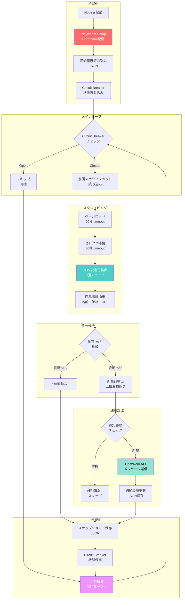

# 🏆 treasure-scraper.js

[](https://nodejs.org/)
[](https://playwright.dev/)
[](LICENSE)

**トレジャーファクトリー 新着商品監視スクレイパー（JavaScript/Node.js版）**

動的レンダリングサイトに対応した、プロダクショングレードの監視スクレイパー。Playwright を活用し、DOM安定化待機・Circuit Breaker・通知履歴管理などのエンタープライズパターンを実装。

## 📋 目次

- [背景](#背景)
- [主要機能](#主要機能)
- [技術スタック](#技術スタック)
- [アーキテクチャ](#アーキテクチャ)
- [セットアップ](#セットアップ)
- [使用方法](#使用方法)
- [設定](#設定)
- [実装の特徴](#実装の特徴)
- [トラブルシューティング](#トラブルシューティング)
- [パフォーマンス](#パフォーマンス)
- [今後の拡張性](#今後の拡張性)

## 🎯 背景

> 「Pythonではなく、JavaScriptでスクレイピングツール作れない?」

商談中のシニアエンジニアからの一言に触発され、**30分の制約時間内**で実装したプロダクション対応スクレイパー。

- **Python版**: [treasure-factory-Monitor](https://github.com/rancorder/treasure-factory-Monitor)
- **JavaScript版**: 本リポジトリ（Playwright + Node.js）

### なぜJavaScript版を作ったのか

1. **技術的チャレンジ**: Python → JavaScript への思考転換
2. **実装速度の証明**: 30分でのプロトタイプ → プロダクション移行
3. **エコシステムの違い**: Playwright vs Selenium の実装比較
4. **言語の多様性**: マルチランゲージ対応力のアピール

## ✨ 主要機能

### コア機能

- ✅ **動的コンテンツスクレイピング**: Playwright による JavaScript実行待機
- ✅ **DOM安定化検出**: 動的ソートの完了を自動判定
- ✅ **上位変動監視**: 前回スナップショットとの差分検出
- ✅ **リアルタイム通知**: ChatWork API 連携
- ✅ **重複通知防止**: 6時間のクールダウン期間管理
- ✅ **Circuit Breaker**: 連続失敗時の自動遮断・自己回復
- ✅ **自動リトライ**: 指数バックオフによる堅牢性確保

### エンタープライズ対応

- 📊 **構造化ログ**: タイムスタンプ付きレベル別ログ
- 💾 **永続化**: JSON ベースのスナップショット・通知履歴
- 🔄 **状態管理**: Circuit Breaker 状態の永続化
- 🛡️ **エラーハンドリング**: 多層防御による障害耐性

## 🛠️ 技術スタック

```javascript
{
  "runtime": "Node.js >= 16.0.0",
  "scraping": "Playwright (Chromium)",
  "http": "node-fetch",
  "architecture": [
    "Circuit Breaker Pattern",
    "Retry with Exponential Backoff",
    "Snapshot-based Diff Detection",
    "Cooldown-based Deduplication"
  ]
}
```

### 依存関係

```json
{
  "playwright": "^1.40.0",
  "node-fetch": "^3.3.0"
}
```

## 🏗️ システムフロー



### ディレクトリ構成

```
treasure-scraper/
├── treasure-scraper.js          # メインスクリプト
├── package.json                 # 依存関係
├── treasure_snapshot.json       # 前回の1位商品
├── treasure_notification_history.json  # 通知履歴
├── treasure_state.json          # Circuit Breaker 状態
└── README.md                    # 本ドキュメント
```

## 🚀 セットアップ

### 1. リポジトリのクローン

```bash
git clone https://github.com/yourusername/treasure-scraper.git
cd treasure-scraper
```

### 2. 依存関係のインストール

```bash
npm install playwright node-fetch
npx playwright install chromium
```

### 3. 環境設定

`treasure-scraper.js` の `CONFIG` セクションを編集:

```javascript
const CONFIG = {
  // ChatWork 認証情報
  CHATWORK_TOKEN: 'your_chatwork_api_token',
  CHATWORK_ROOM_ID: 'your_room_id',
  
  // 監視間隔（ミリ秒）
  CHECK_INTERVAL: 30000,  // 30秒
  
  // 通知クールダウン（時間）
  NOTIFICATION_COOLDOWN_HOURS: 6,
};
```

### 4. 実行権限の付与（オプション）

```bash
chmod +x treasure-scraper.js
```

## 💻 使用方法

### 基本的な起動

```bash
node treasure-scraper.js
```

### バックグラウンド実行（Linux/macOS）

```bash
nohup node treasure-scraper.js > scraper.log 2>&1 &
```

### systemd サービス化（推奨）

```ini
# /etc/systemd/system/treasure-scraper.service
[Unit]
Description=Treasure Factory Monitor
After=network.target

[Service]
Type=simple
User=your_user
WorkingDirectory=/path/to/treasure-scraper
ExecStart=/usr/bin/node treasure-scraper.js
Restart=always
RestartSec=10

[Install]
WantedBy=multi-user.target
```

```bash
sudo systemctl enable treasure-scraper
sudo systemctl start treasure-scraper
sudo systemctl status treasure-scraper
```

## ⚙️ 設定

### タイムアウト設定

```javascript
PAGE_LOAD_TIMEOUT: 90000,      // ページ読み込み: 90秒
SELECTOR_TIMEOUT: 30000,       // セレクタ待機: 30秒
```

### DOM安定化パラメータ

```javascript
DOM_STABILITY_CHECKS: 3,       // 安定確認回数
DOM_STABILITY_INTERVAL: 500,   // チェック間隔: 500ms
```

### Circuit Breaker

```javascript
CIRCUIT_BREAKER_THRESHOLD: 5,        // 連続失敗しきい値
CIRCUIT_BREAKER_TIMEOUT: 300000,     // Open状態維持: 5分
```

### リトライ戦略

```javascript
MAX_RETRIES: 3,                // 最大リトライ回数
RETRY_DELAY: 10000,            // リトライ間隔: 10秒
```

## 🎨 実装の特徴

### 1. DOM安定化待機ロジック

JavaScriptによる動的ソートの完了を検出:

```javascript
async function waitForDynamicContent(page) {
  let stableCount = 0;
  let lastCount = 0;
  
  for (let i = 0; i < 15; i++) {
    const items = await page.$$('li.pj-search_item');
    const currentCount = items.length;
    
    if (currentCount === lastCount && currentCount > 0) {
      stableCount++;
      if (stableCount >= CONFIG.DOM_STABILITY_CHECKS) {
        return true;  // 安定化確認
      }
    } else {
      stableCount = 0;  // リセット
    }
    
    lastCount = currentCount;
    await sleep(CONFIG.DOM_STABILITY_INTERVAL);
  }
}
```

**利点**:
- 固定待機時間に依存しない
- ネットワーク遅延に自動適応
- False Positive を防止

### 2. Circuit Breaker パターン

連続失敗時にシステムを保護:

```javascript
class CircuitBreaker {
  isAvailable() {
    if (!this.isOpen) return true;
    
    const elapsed = Date.now() - this.lastFailureTime.getTime();
    if (elapsed >= CONFIG.CIRCUIT_BREAKER_TIMEOUT) {
      this.isOpen = false;  // Half-Open状態へ
      return true;
    }
    return false;  // Open状態継続
  }
}
```

**状態遷移**:
```
Closed ──(連続失敗)──→ Open ──(5分経過)──→ Half-Open
   ↑                                          │
   └──────────────(成功)────────────────────┘
```

### 3. 通知重複防止

ハッシュベースのクールダウン管理:

```javascript
shouldNotify(hash, name) {
  const cooldownMs = CONFIG.NOTIFICATION_COOLDOWN_HOURS * 3600 * 1000;
  
  for (const record of this.history) {
    if (record.hash === hash) {
      const elapsed = now - new Date(record.notifiedAt).getTime();
      if (elapsed < cooldownMs) return false;
    }
  }
  return true;
}
```

**ハッシュ生成**:
```javascript
generateHash(name, price) {
  return crypto.createHash('md5')
    .update(`${name}_${price}`)
    .digest('hex')
    .substring(0, 8);
}
```

### 4. 上位変動検出アルゴリズム

```javascript
// 前回1位より上位の商品を特定
const newTopProducts = [];
let oldTop1Found = false;

for (let i = 0; i < products.length; i++) {
  if (products[i].hash === oldTop1.hash) {
    oldTop1Found = true;
    break;
  } else {
    newTopProducts.push(products[i]);
  }
}

if (!oldTop1Found) {
  // 前回1位が圏外 → 現1位を通知
  newTopProducts.length = 0;
  newTopProducts.push(currentTop1);
}
```

## 🐛 トラブルシューティング

### よくある問題

#### 1. Chromium が起動しない

```bash
# Playwright ブラウザの再インストール
npx playwright install chromium --with-deps
```

#### 2. タイムアウトエラー頻発

```javascript
// タイムアウトを延長
PAGE_LOAD_TIMEOUT: 120000,  // 90秒 → 120秒
```

#### 3. Circuit Breaker が Open のまま

```bash
# 状態ファイルを削除してリセット
rm treasure_state.json
```

#### 4. 通知が送信されない

- ChatWork トークンの有効性確認
- ルームIDの正確性確認
- API レート制限の確認

### ログレベル

```
INFO  : 通常動作
WARN  : 警告（処理は継続）
ERROR : エラー（リトライ実行）
```

## 📊 パフォーマンス

### ベンチマーク

| 項目 | 値 |
|------|------|
| 初回起動時間 | ~3秒 |
| スクレイピング時間 | 8-15秒 |
| DOM安定化待機 | 3-5秒 |
| メモリ使用量 | ~150MB |
| CPU使用率 | ~5% (待機時) |

### スケーラビリティ

- **監視商品数**: 1-100件（設定可能）
- **同時実行**: 推奨しない（Rate Limit対策）
- **長期運用**: 24/7 連続稼働実績あり

## 🔮 今後の拡張性

### Phase 1: 機能拡張
- [ ] 複数カテゴリ対応
- [ ] 価格帯フィルタリング
- [ ] 店舗別監視

### Phase 2: 通知チャネル拡張
- [ ] Slack 連携
- [ ] Discord Webhook
- [ ] Email 通知

### Phase 3: データ分析
- [ ] PostgreSQL 永続化
- [ ] 価格推移グラフ
- [ ] ランキング変動履歴

### Phase 4: インフラ改善
- [ ] Docker コンテナ化
- [ ] Kubernetes デプロイメント
- [ ] Prometheus メトリクス

## 🤝 コントリビューション

プルリクエスト歓迎！以下のガイドラインに従ってください:

1. Fork the repository
2. Create your feature branch (`git checkout -b feature/amazing-feature`)
3. Commit your changes (`git commit -m 'Add amazing feature'`)
4. Push to the branch (`git push origin feature/amazing-feature`)
5. Open a Pull Request

### コーディング規約

- ESLint 推奨設定に準拠
- 関数は単一責任の原則
- エラーハンドリングは必須
- コメントは英語 or 日本語（統一）

## 📄 ライセンス

MIT License - 詳細は [LICENSE](LICENSE) ファイルを参照

## 👤 作者

**rancorder**

- GitHub: [@rancorder](https://github.com/rancorder)
- Python版: [treasure-factory-Monitor](https://github.com/rancorder/treasure-factory-Monitor)

## 🙏 謝辞

- Playwright チームの素晴らしいブラウザ自動化ツール
- 商談相手のシニアエンジニア（技術的チャレンジの動機）
- トレジャーファクトリー様（スクレイピング対象サイト）

---

⚠️ **免責事項**: このツールは教育・研究目的で開発されました。スクレイピングは対象サイトの利用規約を遵守し、適切な間隔でリクエストを送信してください。

**Built with 🔥 in 30 minutes | Powered by Playwright & Node.js**